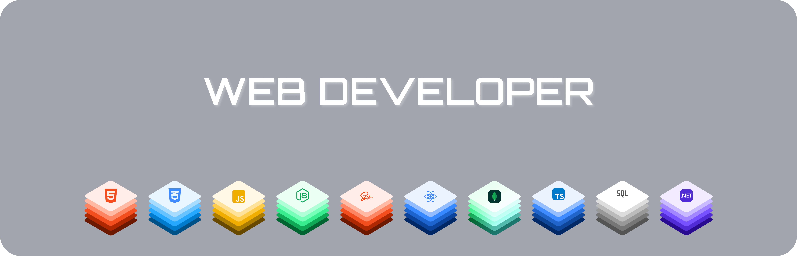

---

- ### Phase 1: HTML & CSS
  - **Learn**
   
    - [ ] [HTML - MDN](https://developer.mozilla.org/en-US/docs/Web/HTML)
    - [ ] [MDN - CSS](https://developer.mozilla.org/en-US/docs/Web/CSS)
    - [ ] [C_ HTML](https://www.codecademy.com/resources/docs/html)
    - [ ] [C_ CSS](https://www.codecademy.com/resources/docs/css)
  - **Cheat Sheet**
    - [ ] [CSS Reference](https://cssreference.io)
    - [ ] [HTML Reference](https://htmlreference.io)
  - **Practice Project** 
    - [ ] [FreeCodeCamp](https://www.freecodecamp.org/learn/2022/responsive-web-design/)
---
- ### Phase 2: JavaScript
  - **Learn**
    - [ ] [JavaScript - MDN](https://developer.mozilla.org/en-US/docs/Web/JavaScript)
    - [ ] [javascript.info](https://javascript.info/)
    - [ ] [30-Days-JavaScript](https://github.com/Asabeneh/30-Days-Of-JavaScript)
    - [ ] [W3S - TypeScript](https://www.w3schools.com/typescript/index.php) 
    - [ ] [Codecademy - TypeScript](https://www.codecademy.com/resources/docs/typescript/about-typescript)
  - **Practice Project**
    - [ ] [FreeCodeCamp - JavaScript Algorithms and Data Structures](https://www.freecodecamp.org/learn/javascript-algorithms-and-data-structures/)
    - [ ] [JavaScript30](https://courses.wesbos.com/account/access/617db9c841ee9b1bad8dee49/view/194130650)
---
- ### Phase 3: Front End Development Libraries
  - **Learn**
    - [ ] [Bootstrap](https://htmlreference.io)
    - [ ] [jQuery](https://www.w3schools.com/jquery/default.asp)
    - [ ] [Sass](https://sass-lang.com/documentation/)
    - [ ] [React](https://github.com/Asabeneh/30-Days-Of-React)
    - [ ] [Redux](https://courses.wesbos.com/account/access/63e80f9181d1289fa3779813)
  - **Practice Project**
    - [ ] [FreeCodeCamp - Front End Development Libraries](https://www.freecodecamp.org/learn/front-end-development-libraries/)

---
- ### Phase 4: Data Visualization 
  - **Learn**
    - [ ] [D3 API Reference](https://github.com/d3/d3/blob/main/API.md)
  - **Practice Project**
    - [ ] [FreeCodeCamp - Data Visualization](https://www.freecodecamp.org/learn/data-visualization/)
---
- ### Phase 5: Relational Database (Beta)
    - [ ] [FreeCodeCamp - Relational Database](https://www.freecodecamp.org/learn/relational-database/)
---
- ### Phase 6: Back End Development and APIs
  - **Learn**
    - [ ] [Managing Packages with NPM](https://nodejs.dev/en/learn/introduction-to-nodejs/)
    - [ ] [Basic Node and Express](https://www.w3schools.com/nodejs/)
    - [ ] [MongoDB and Mongoose](https://learn.mongodb.com/learning-paths/introduction-to-mongodb)
    - [ ] [GraphQL](https://app.patika.dev/courses/graphql)
  - **Practice Project** 
    - [ ] [FreeCodeCamp - Back End Development and APIs](https://www.freecodecamp.org/learn/back-end-development-and-apis/)
---
- ### Phase 7: Quality Assurance
  - **Learn**
    - [ ] [JavaScript - MDN]()
  - **Practice Project** 
    - [ ] [FreeCodeCamp - Quality Assurance](https://www.freecodecamp.org/learn/back-end-development-and-apis/)
